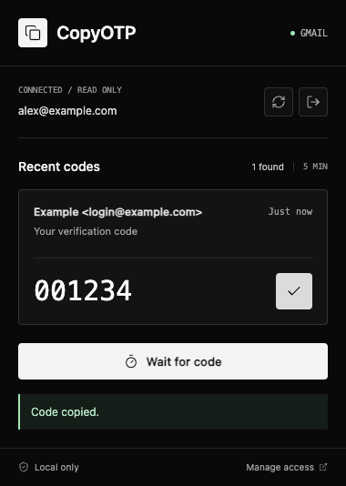

# CopyOTP

A small Chrome extension for copying recent Gmail login codes while staying on
the login page. Gmail can be closed. It uses Chrome's OAuth flow and reads Gmail
directly; email normalization and code extraction happen on your device.



Built by AlexWorks. An independent utility, not affiliated with SpaceX, xAI,
Grok, or Google. No AI models are used and no mailbox content leaves the device
for developer-controlled services. Public source does not imply a verified OAuth
app or a published Chrome Web Store listing.

## Publish and Contribute

The code is [MIT licensed](LICENSE). Issues and pull requests are welcome;
see [CONTRIBUTING.md](CONTRIBUTING.md) and [SECURITY.md](SECURITY.md).

Follow the [step-by-step Chrome Web Store release guide](PUBLISHING.md), including
the AlexWorks shared-consent-screen decision, store ID/OAuth binding, privacy
declarations, and separate Google verification. Read the [privacy policy](PRIVACY.md).

If your Google Cloud project quota is full, the guide's current path uses the
existing AlexWorks project with a separate store-ID OAuth client. Pending project
deletions do not free capacity immediately; a quota increase is an optional route
to a dedicated production project later. Shared-project verification still
needs to represent the other AlexWorks apps accurately.

## Build and Load

Requires Node.js 22.18+ (or Node.js 24+) and Chrome 116+.

```sh
npm install
npm run build
```

Open `chrome://extensions`, enable Developer mode, choose **Load unpacked**, and
select the `dist` directory. Before OAuth is configured, the popup displays the
extension ID and a setup state. The build also prints the ID.

`config.local.json` is generated on the first build. Its public key keeps the
extension ID stable across rebuilds. Keep this file for your local setup; losing
it generates a different ID and requires a new OAuth client. No private key or
client secret is generated or stored. The file and `dist` are git-ignored.

## Configure Google OAuth

1. Create or select a project in [Google Cloud](https://console.cloud.google.com/).
2. Enable the **Gmail API** in APIs & Services.
3. Configure Google Auth Platform branding and audience. For an external app in
   testing, add your Gmail address as a test user. Workspace organizations may
   allow an internal app; organization policies can still restrict access.
4. In Data Access, add `https://www.googleapis.com/auth/gmail.readonly`.
5. In Clients, create a **Chrome Extension** OAuth client. Use the extension ID
   printed by the build as the Item ID. A Web Application client is not suitable.
6. Configure the resulting client ID:

```sh
npm run configure -- YOUR_CLIENT_ID.apps.googleusercontent.com
```

The command saves the public client ID in `config.local.json` and rebuilds the
extension. Use the actual Google-generated ID; no client secret is required.
Reload CopyOTP in `chrome://extensions`, open its popup, and click **Connect
Gmail**. Check that the connected email address is the account you intend to use.
The first version uses the account selected by Chrome's Identity API.

See [Chrome's OAuth setup](https://developer.chrome.com/docs/extensions/how-to/integrate/oauth)
and [Gmail scope requirements](https://developers.google.com/workspace/gmail/api/auth/scopes).
Public distribution requires the applicable Google OAuth verification and Chrome
Web Store review. When moving to a store-issued extension key/ID, register the
OAuth client against that ID and update the public key in the local build config.

## Use

Request a code on a login page, click CopyOTP, and click **Copy** beside the
matching sender/message. Close the popup and paste into the login form. CopyOTP
never auto-fills or submits a form.

The popup checks mail from the last five minutes, including read and archived
messages. A scan reads at most 20 messages; **Check more recent messages** reads
the next page. **Wait for code** checks every five seconds for up to one minute
while the popup stays open. Closing the popup stops waiting and aborts active
mail requests. OAuth consent can finish after the popup closes; reopen it to scan.

The MVP supports contiguous numeric codes of 4-8 digits in English login emails.
It requires nearby code language and shows every plausible choice. The sender
and received age help you choose; neither guarantees that a message is authentic
or the code is still valid. Codes older than five minutes cannot be copied through
the button. Request another code if the site reports it has expired.

## Privacy and Permissions

- `identity`: authorize read-only Gmail access; Chrome manages token caching.
- `storage`: save only whether you explicitly connected Gmail. No mail, codes,
  account addresses, or OAuth tokens are persisted by CopyOTP.
- `clipboardWrite`: copy only the selected code after your click.
- Host access is limited to `https://gmail.googleapis.com/*`.

Google's read-only scope permits reading the mailbox, although CopyOTP requests
only recent messages. CopyOTP does not send, delete, mark as read, or modify mail.
It has no backend, telemetry, remote scripts, or access to login-page content.
Attachments are not downloaded. Message HTML is parsed in an inert template and
never displayed as live HTML. Email bodies and candidates remain in transient
memory during the popup session.

**Disconnect Gmail** disables further scans and clears Chrome's cached tokens.
To revoke the underlying Google grant, use **Manage access** and remove CopyOTP
from [Google account connections](https://myaccount.google.com/connections).
Disconnecting alone does not promise grant revocation. Copied codes remain in
your clipboard and may be kept by your OS clipboard manager.

With the shared AlexWorks OAuth project, Google may display AlexWorks rather
than CopyOTP on consent. Removing that shared grant may affect other AlexWorks
apps. Local disconnect only disables CopyOTP and clears its cached tokens.

## Verify

```sh
npm run check
npm test
npm run build
npm run test:ui
```

UI tests use a mock Chrome transport and synthetic email fixtures, never a live
mailbox. Install Playwright Chromium with `npx playwright install chromium`, or
set `CHROME_PATH` to a local Chrome/Chromium executable. Screenshots are saved in
`artifacts`. Tests cover extraction, read-only API requests, token refresh,
throttling, popup states, copying, waiting, HTML safety, and disconnect races.

To verify the real extension manifest, service worker, popup transport, and ID,
run `npm run test:extension` with Playwright Chromium or Chrome for Testing.
`CHROME_PATH` can select that executable; regular Chrome builds may disable the
command-line flags needed to load an extension in automation.

For the live check, connect your test Gmail account, close Gmail, request a real
login code, and copy/paste it. Verify the message remains unread. Live OAuth and
Gmail delivery require your own configured client and consent; mock tests cannot
prove those steps.
